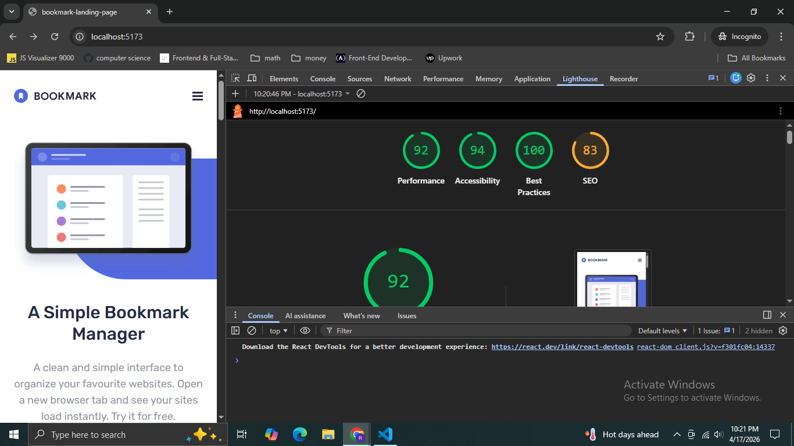

# Frontend Mentor - Bookmark landing page solution

This is a solution to the [Bookmark landing page challenge on Frontend Mentor](https://www.frontendmentor.io/challenges/bookmark-landing-page-5d0b588a9edda32581d29158)

## Table of contents

- [Overview](#overview)
  - [The challenge](#the-challenge)
  - [Screenshot](#screenshot)
  - [Links](#links)
- [My process](#my-process)
  - [Built with](#built-with)
  - [What I learned](#what-i-learned)
  - [Continued development](#continued-development)
  - [Useful resources](#useful-resources)
- [Author](#author)

## Overview

### The challenge

Users should be able to:

- View the optimal layout for the site depending on their device's screen size.
- See hover states for all interactive elements on the page.
- Receive an error message when the newsletter form is submitted if:
  - The input field is empty.
  - The email address is not formatted correctly.
- Switch between different feature tabs with smooth state transitions.

### Screenshot


(./design/Screenstot-2.png)(./design/Screenstot-3.png)(./design/Screenstot-4.png)(./design/Screenstot-5.png)


### Links

- Solution URL: [https://github.com/dreamer111111/bookmark-landing-page-react-tailwindcss]
- Live Site URL: [https://bookmark-landing-page-react-tailwin.vercel.app/]

## My process
1. Folder Structure
2. Common things created
3. Each section 
4. Assemble All Things
5. Fix Layouts, Spacing and other problems


### Built with

- **React (Vite)** - For a fast, component-based development experience.
- **Tailwind CSS** - For utility-first styling and rapid responsive design.
- **Mobile-first workflow** - Ensuring the site looks great on small screens first.
- **State Hooks** - Used for Tab switching and Accordion functionality.

### What I learned

One of the biggest challenges in this project was the decorative "pill" shapes that sit behind the illustrations. Since they bleed off the edge of the screen, I used `absolute` positioning combined with `overflow-x-clip` on the parent sections to prevent horizontal scrolling.

**Responsive Background Logic:**
I learned how to shift these decorations based on the layout change from mobile (stacked) to desktop (side-by-side).
```jsx
/* Logic for the Feature Tab "Pill" */
<div className="absolute top-[50%] md:top-[80%] left-0 bg-brand-blue w-[80%] md:w-[45%] h-60 md:h-80 rounded-r-full -z-10 translate-y-0 md:translate-y-[-50%]" />
```

### Form Validation:
I implemented a robust email validation system using Regular Expressions. This ensures that the custom error icon and red background state only trigger when the input is truly invalid.

### Typography & Brand:
I learned the importance of visual hierarchy by using a lighter brand-gray for body text and a deeper brand-dark for headings, avoiding pure black to give the site a more modern, professional look.

### Continued development
Animations: I plan to integrate Framer Motion to animate the tab content as it switches.

### Accessibility: Improving ARIA labels for the Accordion and Tab components to ensure screen-reader compatibility.

Reusable UI: Continuing to refine the Button component to handle multiple variants (primary, white, secondary) more dynamically.

### Useful resources
Tailwind CSS Docs - The go-to guide for managing complex layouts.

React Beta Docs - Helped with understanding the best practices for state management in tabs.

Author
Frontend Mentor - [https://www.frontendmentor.io/profile/dreamer111111]
Twitter - [https://x.com/royrudro032]
LinkedIn - [https://www.linkedin.com/in/rudro-roy-aa9b16298/]